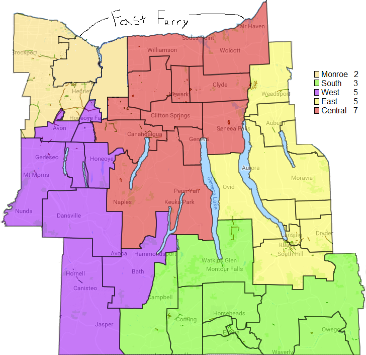

Making a custom RISK bord for a friend for Christmas.

Steps:
* [ ] Prepare the board
  * [x] Get Parish data
  * [ ] Prepare an SVG
  * [ ] Merge parishes down to 42
  * [ ] How to color the areas with B&W?
* [ ] Prepare the pieces
  * [ ] Prepare laser-cut pieces (roman numerals)
  * [ ] Cut them
  * [ ] Paint them
* [ ] Prepare the cards
  * [ ] Prepare SVGs (of merged parishes)
  * [ ] Find or make Bishop/Priest/Deacon art
  * [ ] Lay out card PDFs

Cards:
* http://www.superiorpod.com/product/poker-size-custom-card-decks ($5/deck)
* https://shuffledink.com/request-a-quote/

